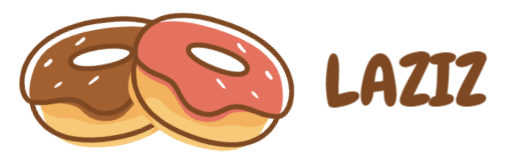

# Laziz

## Branding

Title: Laziz

Logo: 

Vision: …

Mission: …

> Colors:  => https://coolors.co/

- Primary: #ff006e
- Secondary: #8338ec
- Accent: #ffbe0b
- Light: #F3DD96

## Goal

CMS for cooking recipes 

## Users

- Admins
- Users
- Guest

## High Level Specs

- CMS (recipes, categories..)
- Newsletter
- Recommendation system
- Favourite system

## Low Level Specs (users stories)
- As an admin, I can create a new recipe under specific category and fill in the steps
- As an admin, I can publish any recipe to the public
- As an admin, I can delete/edit any recipe 
- As a guest, I can see any public recipe
- As a user, I can favourite any recipe and come back to it later

